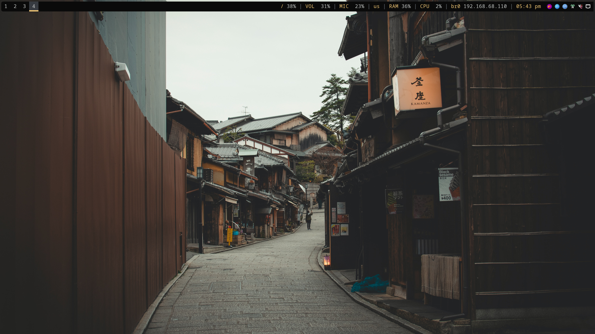
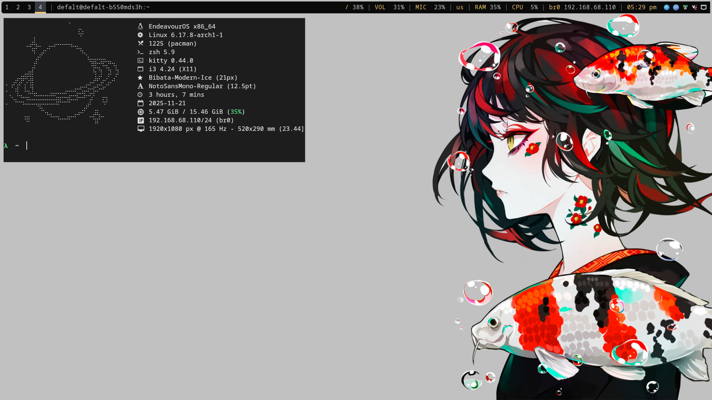
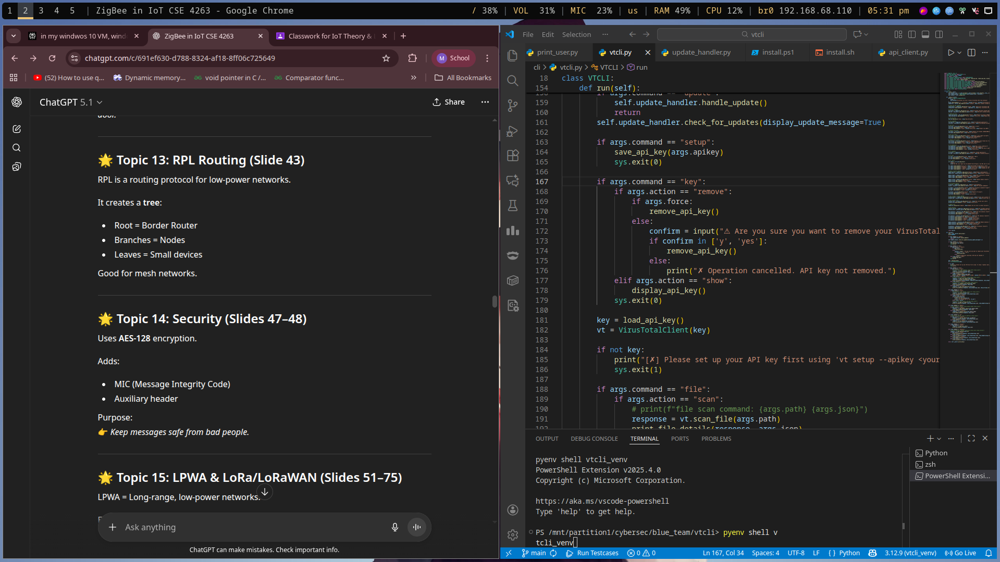

# 🧩 i3 Dotfiles  
A clean, minimal, and fully reproducible i3 setup for Arch Linux (EndeavourOS) — including Polybar, Picom (currently not using it), GTK theming, cursor consistency, theme presets, and a complete backup/restore automation system.

---

## 📸 Screenshots

<table>
  <tr>
    <td></td>
    <td></td>
  </tr>
  <tr>
    <td></td>
    <td></td>
  </tr>
</table>


## 🚀 Features

### ✨ **1. Complete i3 Desktop Environment**
- i3 window manager  
- Polybar (custom configuration)  
- Picom compositor  
- Rofi launcher  
- Xresources (cursor, DPI, X11 tweaks)  

### 🎨 **2. Full Theme Consistency (GTK2/GTK3/GTK4 + X11)**
Includes static configuration for:
- GTK themes  
- Icon themes  
- Cursor themes  
- Fonts  
- Polybar colors  
- i3 colors  
- Xresources cursor mapping  

Themes used:
- **Materia-dark-compact** (GTK)  
- **Papirus-Dark** (icons)  
- **Bibata-Modern-Ice** (cursor)  

### 🎛️ **3. Static Theme System (No daemons needed)**
Everything is controlled using:
- `apply-static-theme.sh`
- `static-theme-switcher.sh`
- `theme-preset-save.sh`
- `theme-preset-load.sh`

You can:
- Save theme presets  
- Switch themes via Rofi menu  
- Keep full control without xsettingsd or lxsession  

### 💾 **4. Dotfiles Backup Tool**
`dot-backup.sh` automatically backs up:

- i3 config  
- Polybar  
- Picom  
- GTK2/GTK3/GTK4  
- Xresources  
- Cursor links  
- Theme scripts  
- Wallpapers (optional)  

Organized into:

```bash
dotfiles/  
├── i3  
├── polybar  
├── picom  
├── gtk  
├── x11  
├── scripts  
└── wallpapers
```


### 🔄 **5. Restore Tool (coming next)**
One command to restore your complete environment on a fresh Arch install.

---
## 📦 Scripts (Coming Soon)

These scripts are part of the planned full automation workflow.  
They are **not included yet**, but will be added in upcoming updates:

| Script | Purpose |
|--------|---------|
| `dot-backup.sh` | Full dotfile backup *(available)* |
| `apply-static-theme.sh` | Apply all theme settings at once *(coming soon)* |
| `static-theme-switcher.sh` | Change theme globally *(coming soon)* |
| `theme-preset-save.sh` | Save current theme into a named preset *(coming soon)* |
| `theme-preset-load.sh` | Load presets with a Rofi menu *(coming soon)* |

All scripts are stored in:  
```bash
~/.local/bin/
```

---

## 🛠️ Installation (Arch Linux)

### 1. Clone the repository:
```bash
git clone https://github.com/Soumyo001/dotfiles.git ~/.dotfiles
cd ~/.dotfiles
```

### 2. Run backup or restore tools:

```bash
./dot-backup.sh # for creating dotfiles
./dot-restore.sh # for restoring configs
```

---

## 🖥️ Dependencies (Auto-Installed on Arch)

The repo includes an installer that ensures these are installed:

- `i3-wm`
- `polybar`
- `picom`
- `rofi`
- `materia-gtk-theme`
- `papirus-icon-theme`
- `bibata-cursor-theme-bin` (AUR)
- `lxappearance`
- `feh`

---
## 🧰 Folder Structure

```bash
dotfiles/
 ├── i3
 ├── polybar
 ├── picom
 ├── gtk
 ├── x11
 ├── scripts
 ├── wallpapers
 ├── README.md
 └── dot-backup.sh
```

---

## 🔧 Customization

You can update the theme inside:

```bash
gtkrc-2.0
gtk-3.0/settings.ini
gtk-4.0/settings.ini
.Xresources
polybar/config.ini
i3/config
```

Static theming do **NOT** require:
- lxsession

**lxsession only handles gtk-3.0 files**